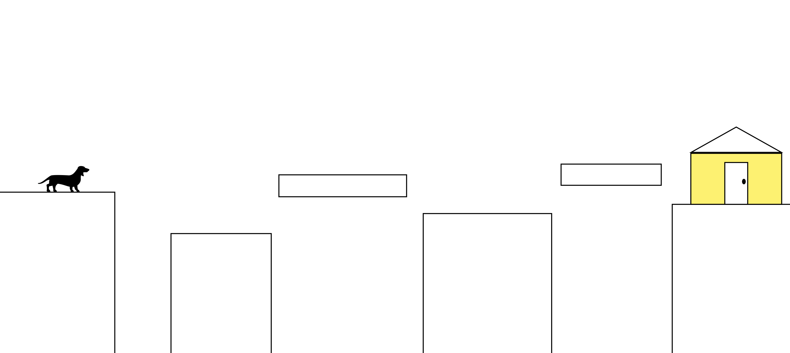

# Fritz in the City

## A fun side-scrolling platformer featuring everyone's favorite dachshund, Fritz!

After a long day chasing squirrels, Fritz is lost in the city, and far from his cozy yellow home. Help him get back into bed by running and jumping your way through the city until you spot his little slice of heaven. Watch out for the gaps between buildings, you know doxies are afraid of heights!

Play the game here: [Fritz in the City] (https://waltersmatthew.github.io/Fritz-in-the-City/) 
---
# Tech Stack

    - HTML 5
    - CSS
    - Javascript
    - Canvas 2D API

---
# Fritz in the city wireframe

---
# MVP goals

    - Render a game screen showing the canvas and controls
    - Render a cityscape gameplay background
    - Render a Fritz dachshund character that can move around the screen
    - Render Fritz's house as an end goal
    - Have WASD movement controls
    - Implement gravity to bring Fritz back to the ground
    - If Fritz falls between buildings, the game restarts
---
# Stretch Goals

    - Scrolling platforms and extend level, adding more platforms and buildings
    - Update Fritz styling to 8-bit sprite
    - Additional sprites for jump, run, and fall actions
    - Implement sound cues to go with various actions
    - Add cat villains as obstacles to jump over
---
# Potential Roadblocks

    - Allow multiple key inputs simultaneously✔️
    - Jump function ✔️
    - Implementing gravity✔️
    - Figuring out scroll functionality✔️
    - Updating from a single rectangle to sprite for movement✔️
---
# Reflections

    - Learned a lot about canvas, implementing 2d graphics and using classes to create as many objects as needed
    - Loops to add functionality on items inside an array
    - Use functions to reduce repetitive code
    - Need to do accessabiltiy reword on color schemes (pink on pink etc)
    - Infinite jumps still unsolved. Tried Jumpcounter < 0 on keydown and if(velocity.y == 0) but will be working on other solutions

---
## Resources

    -Gravity: W3 schools (tinyurl.com/yu3j629t)
    
    -Basic Key controls: W3 schools (tinyurl.com/3r2rxsw9)

    -Scrolling and advanced key controls: Chris Courses on Youtube (https://www.youtube.com/watch?v=4q2vvZn5aoo)
    
    -Fritz sprite: @Tio D on freepik.com
   
    -Background image: Couldn't find orginal artist (https://tinyurl.com/y4be9m9z)
